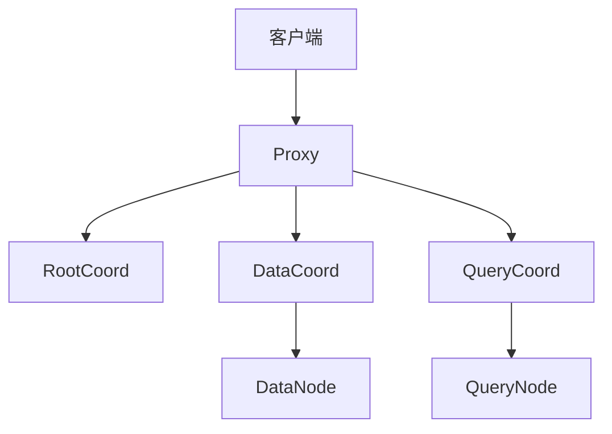

## 一、Milvus 的整体工作流程

Milvus 是一个分布式向量数据库，主要用于大规模向量数据的存储、检索和管理。其核心目标是高效地支持向量检索（如 ANN，Approximate Nearest Neighbor）和结构化数据的混合查询。

### 1. 主要组件
Milvus 2.x 主要由以下几个核心模块组成：

- **Proxy**：请求入口，负责接收客户端请求、预处理、路由和负载均衡。
- **RootCoord**：全局元数据管理，负责 collection/schema/partition 的管理、DDL 操作等。
- **DataCoord**：数据协调，负责数据分片、数据持久化、数据流转等。
- **DataNode**：数据节点，负责数据的具体写入、持久化、binlog 生成等。
- **QueryCoord**：查询协调，负责查询任务的分发、负载均衡、查询节点管理等。
- **QueryNode**：查询节点，负责具体的向量检索、过滤、聚合等操作。
- **IndexCoord/IndexNode**：索引协调与构建，负责索引任务的调度与执行。

### 2. 工作流程（以插入和查询为例）

#### 插入流程
1. **客户端** 发送插入请求到 **Proxy**。
2. **Proxy** 校验请求、分配 ID、预处理数据。
3. **Proxy** 将数据路由到对应的 **DataNode**（通过 DataCoord 协调）。
4. **DataNode** 负责数据的写入和持久化，生成 binlog。
5. **DataCoord** 负责数据分片、binlog 管理和持久化调度。

#### 查询流程
1. **客户端** 发送查询/检索请求到 **Proxy**。
2. **Proxy** 解析请求、校验参数、分发查询任务到 **QueryCoord**。
3. **QueryCoord** 负责将查询任务分发到合适的 **QueryNode**。
4. **QueryNode** 负责实际的向量检索、过滤、聚合等操作。
5. **QueryNode** 返回结果到 **Proxy**，最终返回给客户端。

---

## 二、Proxy 模块详解

### 1. Proxy 的作用

Proxy 是 Milvus 的**请求入口**，主要负责：

- 接收和解析客户端的所有请求（包括 gRPC/RESTful）。
- 进行参数校验、权限校验、数据预处理（如 ID 分配、数据类型转换等）。
- 路由请求到合适的后端服务（如 DataCoord、QueryCoord）。
- 负载均衡和故障转移。
- 聚合后端返回的结果并返回给客户端。

### 2. Proxy 的主要功能

- **请求分发**：根据请求类型（插入、查询、DDL 等）分发到不同的后端服务。
- **ID 分配**：为插入的数据分配全局唯一 ID（通常通过 RootCoord）。
- **数据预处理**：如数据类型转换、批量分包、分区路由等。
- **负载均衡**：支持多 Proxy 实例，自动分担流量。
- **安全校验**：如权限认证、参数校验等。
- **结果聚合**：对于分布式查询，Proxy 负责聚合多个 QueryNode 的结果。

### 3. Proxy 的典型流程（以插入为例）

1. **接收请求**：Proxy 监听客户端的 gRPC/HTTP 请求。
2. **参数校验**：检查 collection、字段、数据格式等是否合法。
3. **ID 分配**：向 RootCoord 申请全局唯一 ID。
4. **数据分包**：将大批量数据分成小包，便于后端处理。
5. **路由分发**：通过 DataCoord 获取目标 DataNode，将数据包发送过去。
6. **异步处理**：Proxy 支持异步批量处理，提升吞吐量。
7. **返回结果**：聚合 DataNode 的响应，返回给客户端。

### 4. Proxy 的高可用与扩展性

- Proxy 可以水平扩展（多实例部署），前端有负载均衡器分发流量。
- Proxy 无状态，故障时可随时替换，不影响整体服务。
- 支持多租户、权限控制等企业级特性。

---

## 三、Proxy 在 Milvus 架构中的位置

---

## 四、总结

- **Proxy 是 Milvus 的网关和流量入口，负责请求预处理、路由、负载均衡和结果聚合。**
- **Proxy 让 Milvus 支持高并发、高可用和易扩展。**
- **Proxy 通过与 RootCoord、DataCoord、QueryCoord 等模块协作，实现数据的高效写入和检索。**
